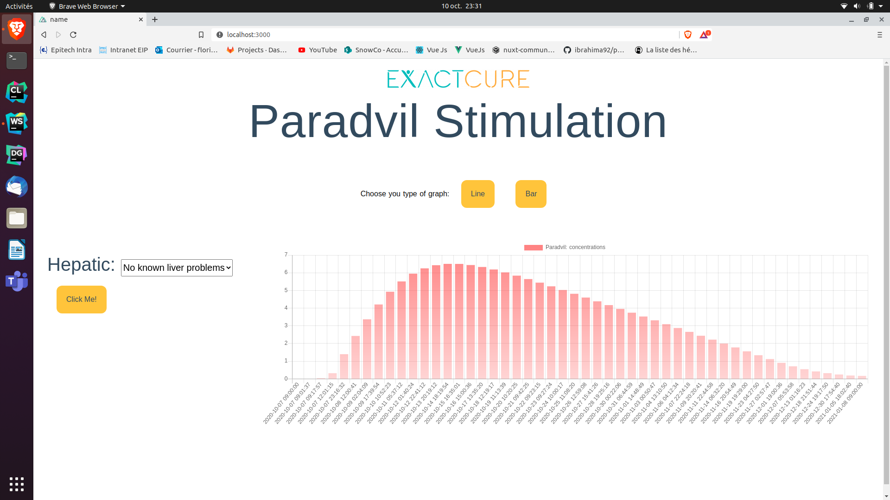

# Paradvil

## Description
 Those softwares provide to patients (with a chart) the evolution of the concentration in their blood for the drug ‘Paradvil’. The covariate to simulate the concentratons of this drug is thehepatic status.

## Link

* [Vue-chart.js](https://vue-chartjs.org/)
* [Nuxt.js](https://fr.nuxtjs.org/)

## Features

* Added a dropdown that lists the different hepatic status
* Added a graph that displays the values obtained according to the hepatic status
* Added two buttons to choose between a line or bar chart

## Getting started

```sh
git clone https://github.com/ftestu/paradvil.git
cd paradvil
npm install
npm build
npm run dev
```
It's as simple as that!
You can go now on [http://localhost:3000/]()



## Build Setup

```bash
# install dependencies
$ npm install

# serve with hot reload at localhost:3000
$ npm run dev

# build for production and launch server
$ npm build
$ npm start

# generate static project
$ npm generate
```
